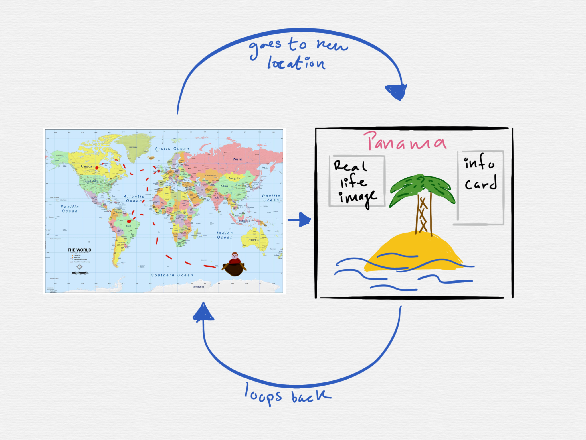

## Preparation and Framing Document
### Background and Context
We are making an interactive educational animation about the environment for fourth graders.

### Key Questions
### Agenda for Technical Review Session
* Start with background and context
* Hear possible concerns
* Introduce our Key Questions
* Discuss with audience
### Feedback Form
